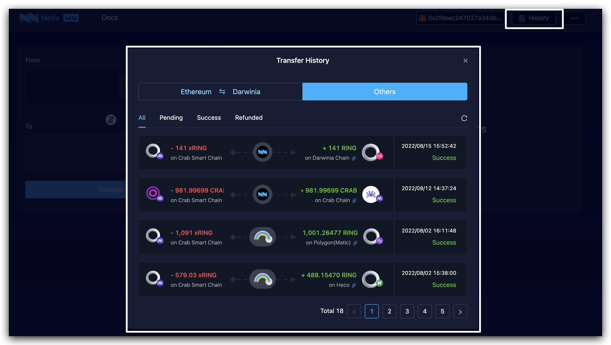
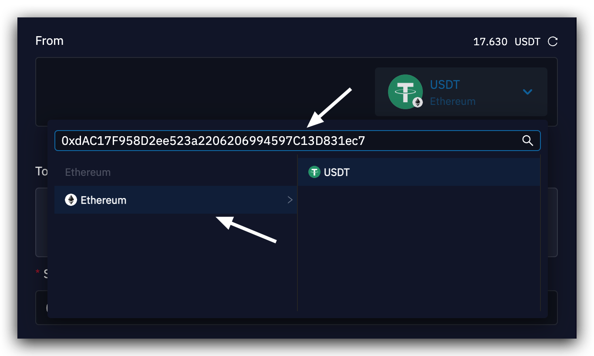
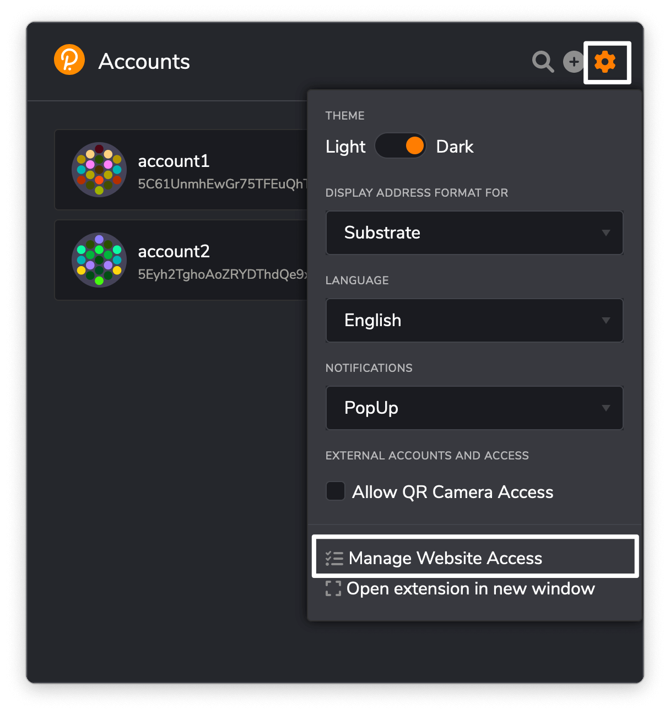
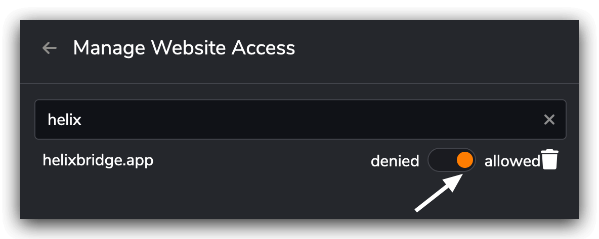
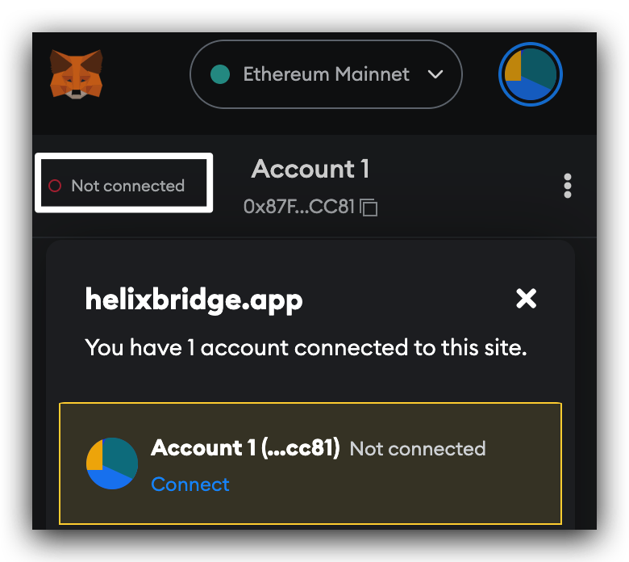

# FAQ
1. **How long does it take to complete a cross chain transfer?**

    Most of the cross-chain transfers take 5-60 minutes to complete via Helix Bridge (Self-developed) and 5-20 minutes via cBridge (Third-Party Token Bridge).
    
    + If your transfer via Helix Bridge is stuck in the pending status for more than 1 hour, feel free to contact [us](mailto:hello@helixbridge.app).
    +  If your transfer via cBridge is stuck in the pending status for more than 30 minutes, please check on [this page](https://cbridge-docs.celer.network/reference/faq#my-cross-chain-transfer-has-been-stuck-for-more-than-30-minutes.-what-should-i-do).
2. **How much fee should be paid for the transfer?**
    
    Helix doesn't charge any fees. The only fees you need to pay are Gas fees (for transactions), and Msg bridging fees (fee paid to bridging provider). For more details, please check on [this page](https://docs.helixbridge.app/user-guide/fee).
    
3. **Where can I find the transfer record?**
    
    You can view all your transfer records by connecting to the specific account address, which is the account you transferred from, and click `History` in the top right  corner of the page.
    
4. **Where is the contract address used in Helix?**
    + You can check on [this page](https://docs.helixbridge.app/introduction/contract_addresses) for the list of contract addresses used in Helix Bridge.
    + You can check on [this page](https://cbridge-docs.celer.network/reference/contract-addresses#contract-address) for the list of contract addresses used in cBridge.
5. **I can't find the token I want to transfer to/from…**
    
    We only support selected assets, you can search them via contract address, or filter by the chain that the token is on.
    
    Please note the options for available tokens and networks that you can transfer to depend on your selection in the previous step. So if you finished selecting the token and network you want to transfer, the options for the token and network that you can transfer to are all listed on the `select token` popup window. If you identify a token we don't support yet, email to [us](mailto:hello@helixbridge.app) and we can list it. 

    Make sure you check the chain before searching the token address!
5. **I can't access the account in my wallet…**   
    You need to give the website permissions to see address, account balance in your wallet extension.    
    For the Polkadot{.js} extension, please check *Manage Website Access* and make sure you've allowed https://helixbridge.app/ to access your account.   
   

    
For MetaMask extension, please make sure the account is connected to https://helixbridge.app/.         

    

6. **Do you have any Testnet Website for developers?**
    
    You can try our [testnet website](https://helix-apps-test.vercel.app/) during your develop work.