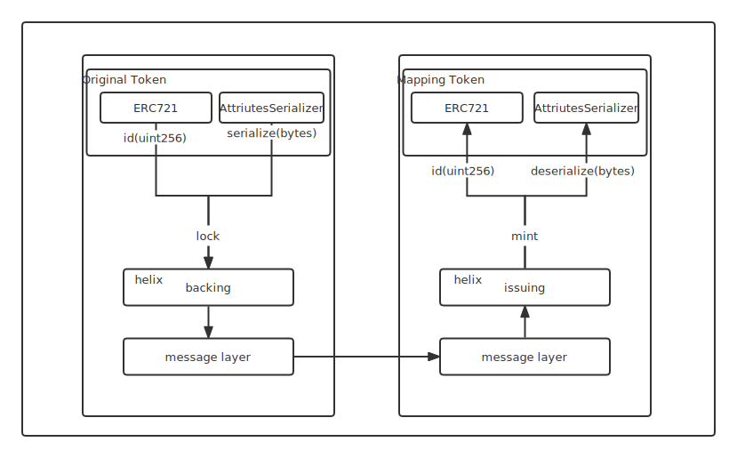

# NFT

Helix considers two main types of NFT Token, Erc721 and Erc1155 standard token.

Erc721 token bridge uses a separation of asset ownership and asset attributes, mapping token types to a uniform Erc721 standard and requiring support for basic Metadata extensions. The attribute management of user-mapped assets is all assigned to the user-defined module.

* Token Variable Attribute Codecs

Before registering the mapping token, the user needs to create modules on top of the source and target chains for encoding and parsing the corresponding Erc721 asset attributes. These attributes will be synchronized between the source and target chains.

* Register

Through the asset registration interface of the Backing module on the source chain, users register Erc721 token and  attribute codec modules of both the source and target chains. After the target chain receives the registration information, it creates the corresponding mapped assets and associates the attribute codec module on the target chain.

* Lock And Issue

The user locks the original Erc721 Token through the Backing Module interface on the source chain, and the Backing encodes the attribute by calling the attribute codec module interface and passes it to the Issuing Module on the target chain through a bridge message with the proof of asset locking. The Issuing module receives the bridge message, issues the corresponding mapped assets to the user's specified account, and calls the attribute decoding interface to set the asset attributes.

Multiple Tokens are supported across chains at the same time.

* Burn And Redeem

User calls the interface of the Issuing module on the target chain to burn mapping token, while the Issuing module calls the attribute encoding module interface to encode the attributes and pass them to the Backing module on the source chain via a bridge message along with the proof of asset burning. Backing module receives the message, unlocks the corresponding original token to the user's specified account, and calls the attribute decoding interface to update the asset attributes.
