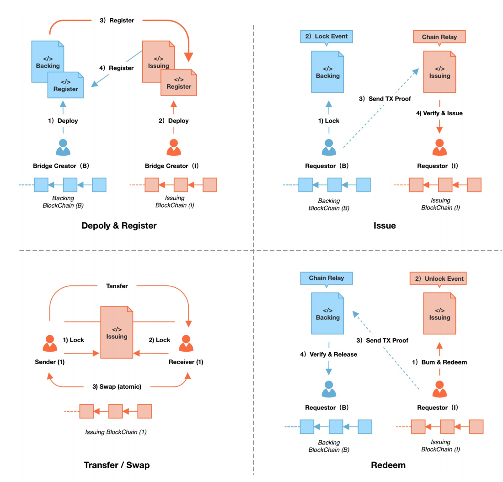
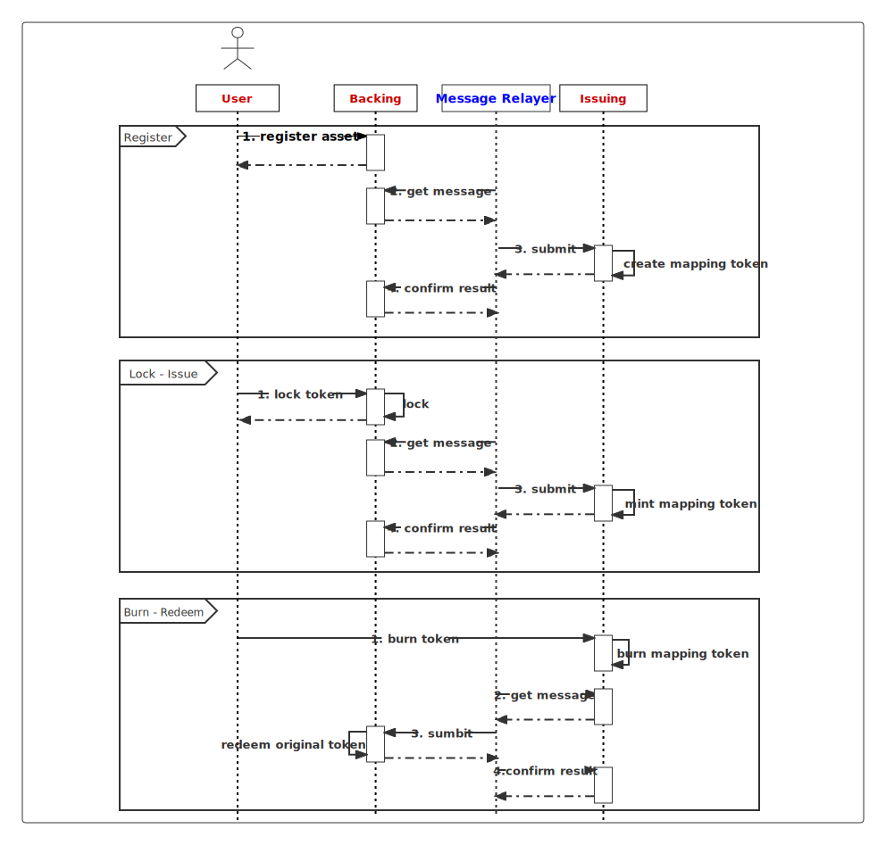

# Token Protocal

An important part of Helix's business is hosting user assets and completing cross-chain asset transfers. It uses an asset registration and cross-chain protocol based on the CBA (Cryptocurrency Backed Asset) model.

## Terminology

### Source Chain And Target Chain
Rrefer to the source blockchain network and the target blockchain network for cross-chain asset transfer via a bridge, respectively, or the caller and the callee of a remote chain call. Generally, a light client of the source chain needs to be built on the target chain to perform cross-chain verification of messages or events from the source chain.

### Origin Token And Mapping Token
This is a relative term. Original token usually refer to assets that have not been bridged to the target chain., such as BTC on the Bitcoin network, ETH or USDT on the Ethernet network. As opposed to a mapping token, which is located on the source chain end of the bridge, and a mapping token, which is located on the target chain end of the bridge, and is a type of asset created with the backing of the original token.

### Relayer
Relayers are a group of competing and supervising entities to maintain and accomplish the bridge's information transfer tasks. Relayers cannot have a substantial impact on the safety of a bridge, but have a direct role in the stability and effectiveness of the bridge.

## CBA Model

Build the Backing module on the source chain and the Issuing module on the target chain, and the underlying call to the generic bridge message channel interface to complete the asset registration and issuance process.

### Backing
Deployed on source chain. User tokens are locked to the Backing module, Backing generates locking proofs, and the tokens are hosted in Backing as an endorsement for asset issuance mapping on the target chain. Until the user initiates a reverse redemption operation, the tokens are unlocked again to the user's account.

### Issuing
Deployed on target chain. Backed by the original token in the locking model, Issuing issues mapping token to the user's account. When a user initiates a redemption operation, Issuing burns the mapping token and generates a proof of destruction for the original token redemption.

## Protocol

### Register
Token registration is the process of registering the original token to the Backing module on the source chain and mapping it to the mapping token on the target chain.
It calls Backing module interface to pass in meta information of the original token, and the message relayer transfers the information to the Issuing module on the target chain to create the corresponding mapping token.
### Lock And Issue
After the asset registration is completed, the user can lock the original token through Backing module, and after Message Relayer synchronizes the locking message to the target chain, Issuing module mint out the same amount of mapping token to the account specified by the user.
### Swap And Other Applications
On the target chain, mapping token have the same token standard as original token, allowing users to execute various types of applications such as swap and transfer.
### Burn And Redeem
Users holding mapping token on the target chain can burn the mapping token by calling the Issuing module interface. Message Relayer will deliver the burning message to the source chain and then the Backing module unlock the original token to the account specified by the user.
