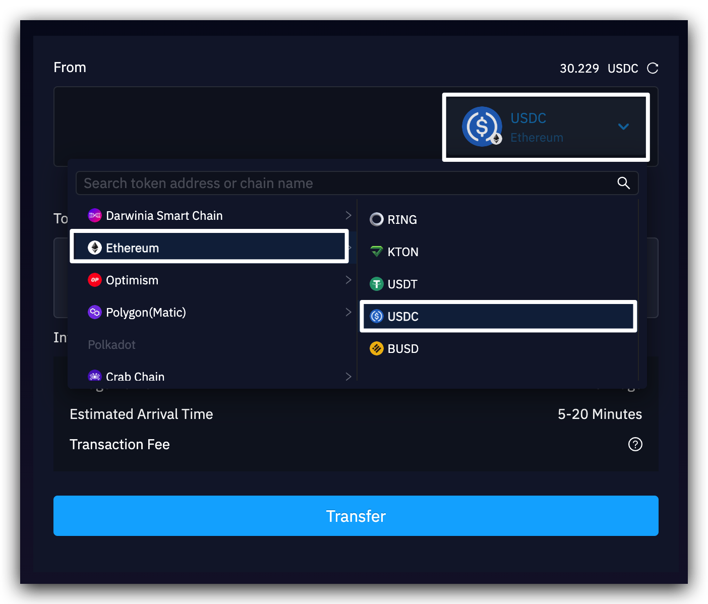
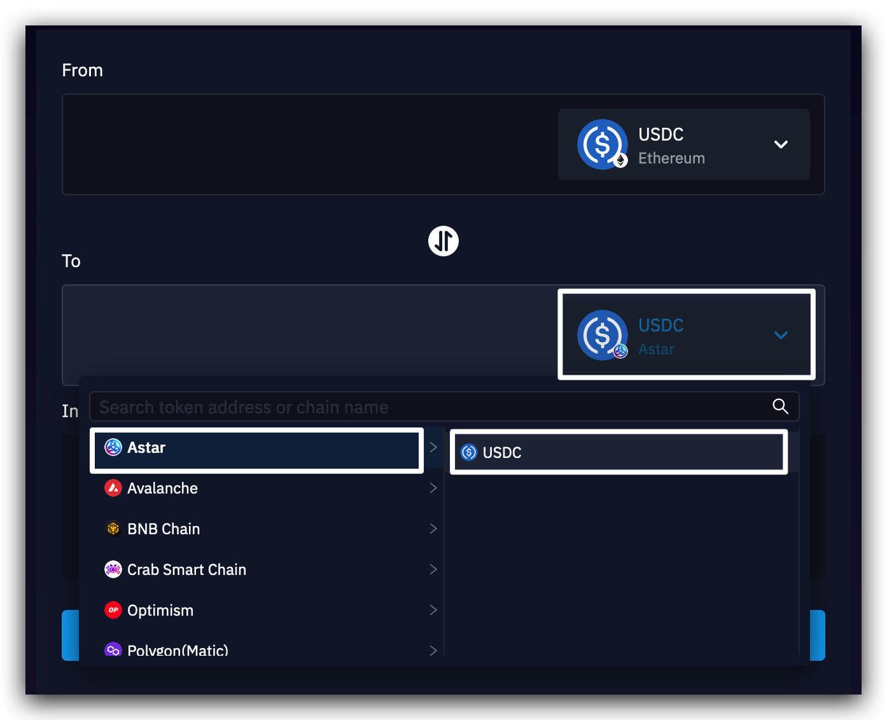
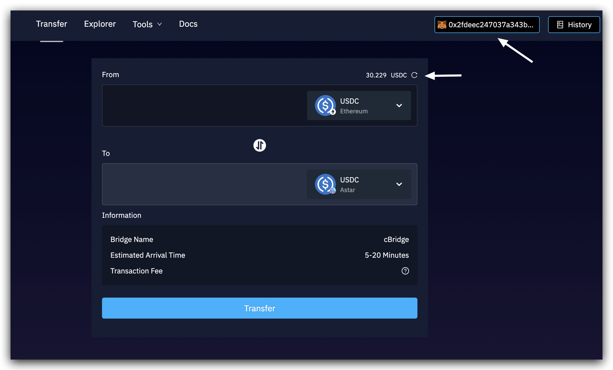
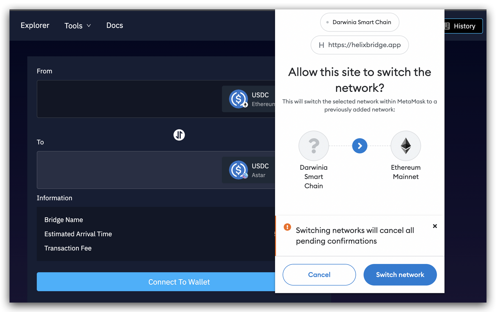
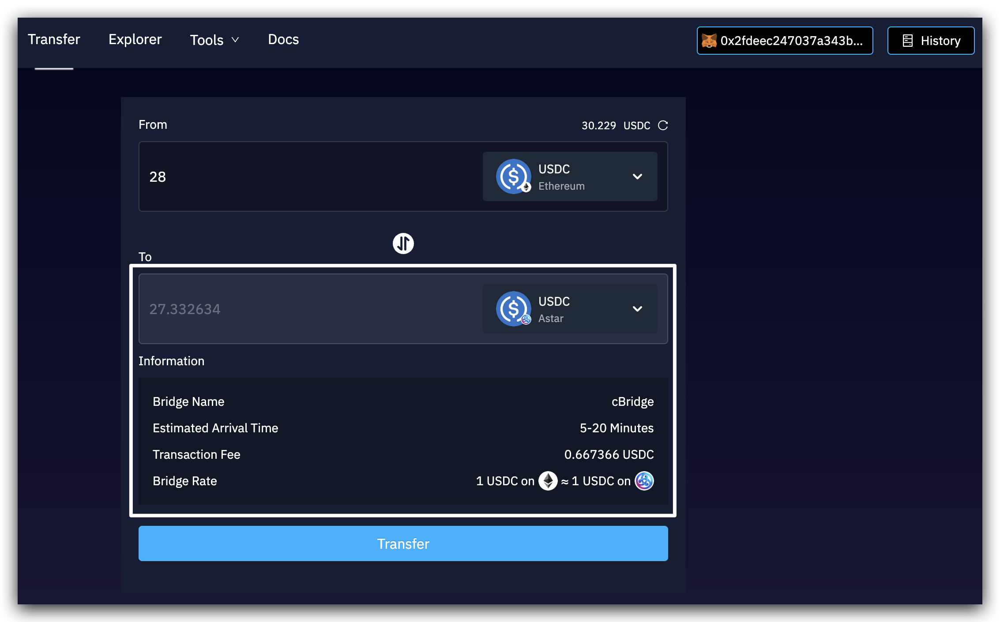
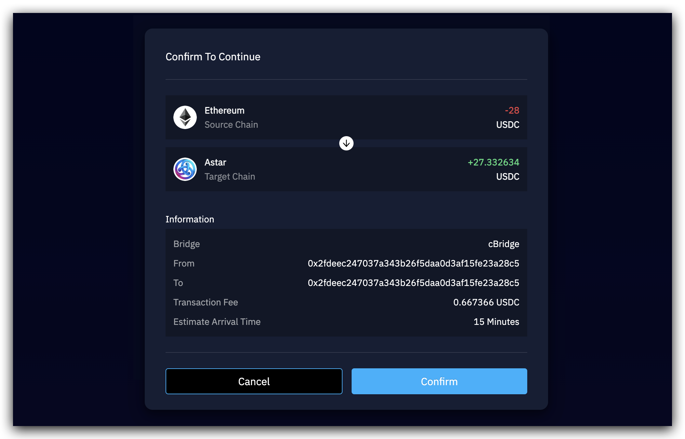
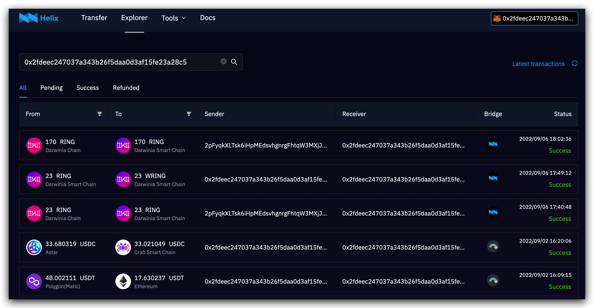
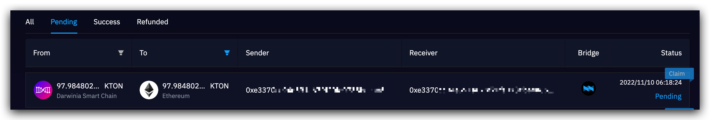
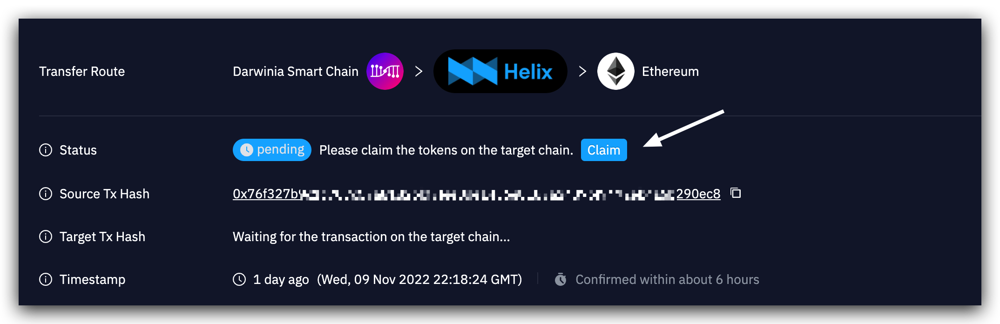

1. Visit Helix Bridge at [helix bridge app](https://helixbridge.app/apps). 
2. **Select a token** that you want to transfer.(make sure that it’s on the proper chain)

3. **Select a target network and the corresponding token** that you want to receive.

*The options for available tokens and target networks depend on your selection in the step2.*
4. **Connect the corresponding wallet**, e.g., polkadot{.js}, MetaMask...    
The current sender address will show in the the top right corner of the page, while the balance of this connected account will show above the From Token Button.   
*You can switch the account by clicking the account when using polkadot{.js} and switch to another account in your wallet when using MetaMask.*

>In case your wallet is connected to a different chain, Helix will prompt to switch to the correct network.
>

5. **Fill in the transfer amount**, and take the information below as a reference.   
     *The estimated token amount you‘ll receive on the target chain will be displayed on the “To” section. The bridge provider, estimated arrival time, estimated transaction fee, etc will be displayed on the information section.* 

6.  Click `Transfer` and you will receive a popup for transfer confirmation. Click `Confirm` only when every detail is checked. 

7. Then you will be prompted to **confirm the transaction in your wallet**. After confirming in your wallet, you have submitted the transaction. You can track the transfer progress by clicking on the "transaction history" in the pop-up window.

8. When the transfer is completed, the transaction status will turn to “Success”. 
You can view all your transfer records in the Explorer Page by connecting to the specific account address or just searching for your account. Click the record and navigate to the transaction detail page to view and track the transfer progress.

>*Sometimes you may need to initiate a claim transaction on the target network to receive the tokens to your wallet. Just check and claim in the transaction detail page.* 
>

