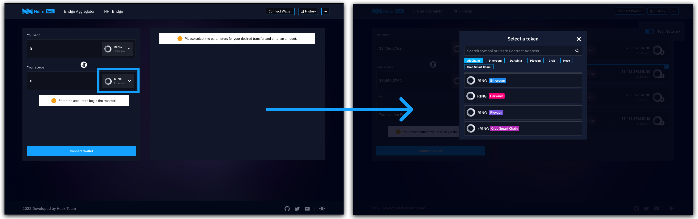
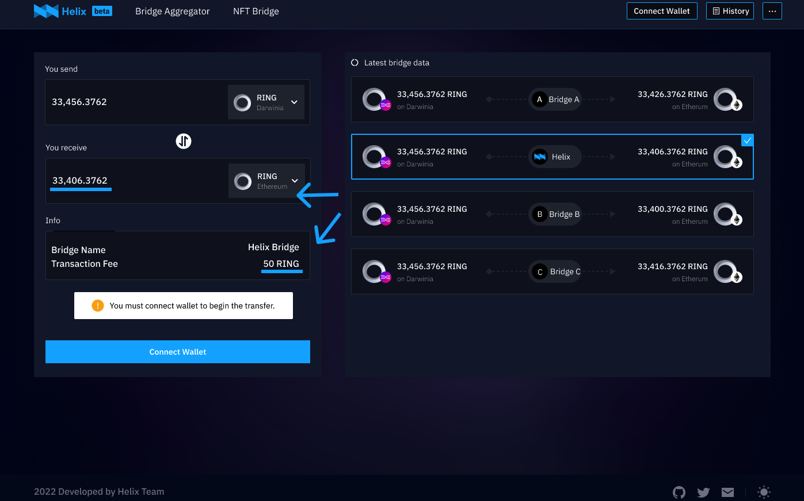
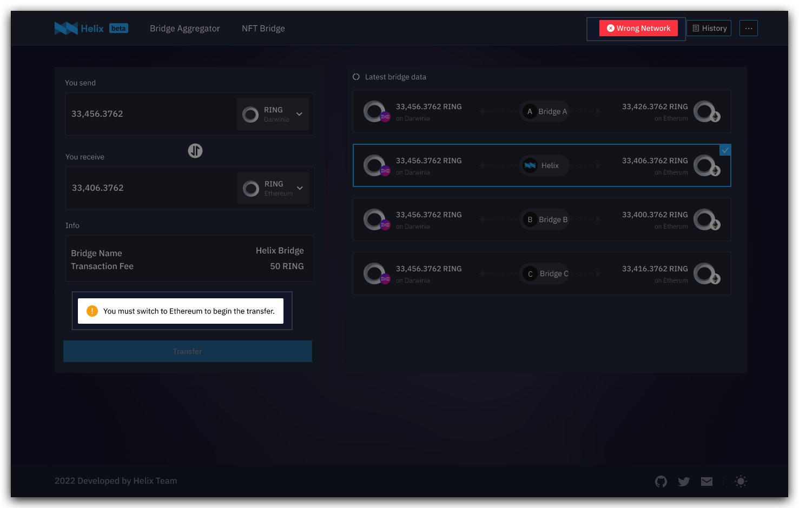
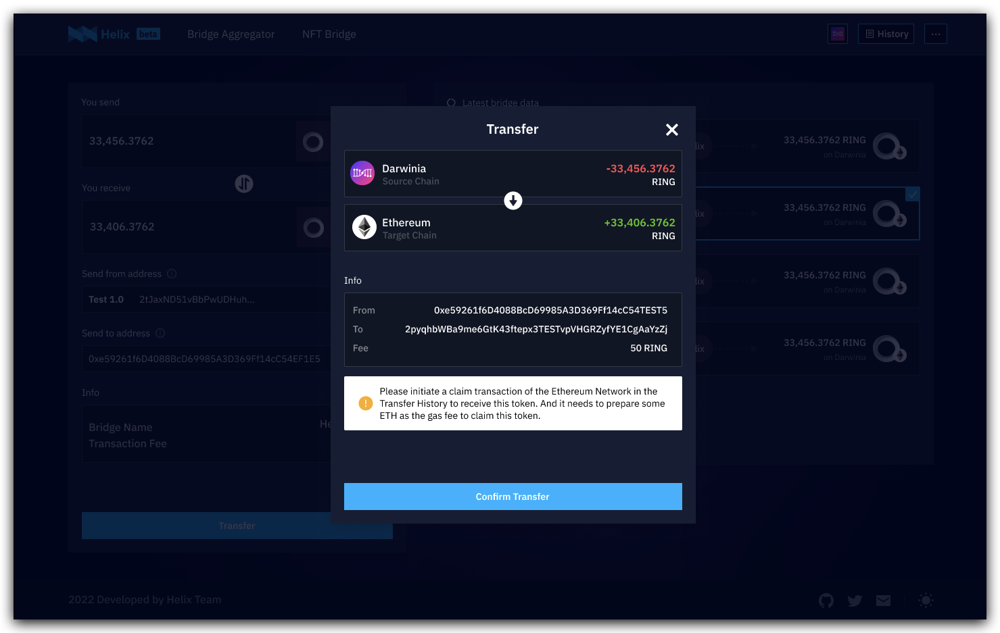
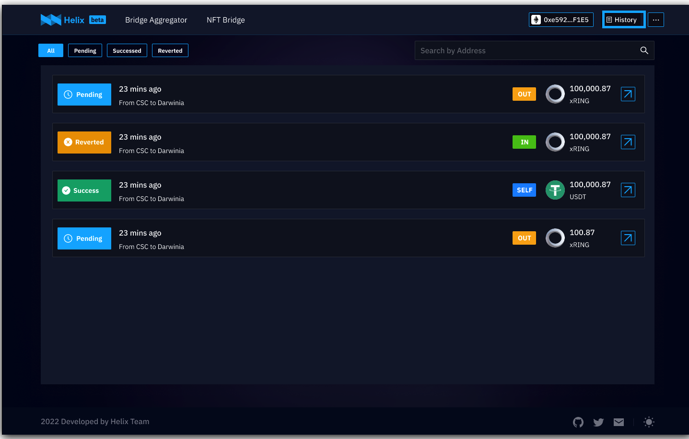

1. Visit Helix Bridge at ____________________. 
2. **Select a token** that you want to transfer. (make sure that it’s on the proper chain)

3. **Select a target network and the corresponding token** that you want to receive.

*The options for available tokens and target networks depend on your selection in the previous step.*
4. **Choose the appropriate bridge** for the transfer:
a. Fill in the transfer amount, the available bridges will be displayed on the right side. 
b. Choose one of them, and you’ll see the estimated transaction fee and estimated token amount you‘ll receive on the target chain. 
c. Make a choice then with this information as a reference.

5. **Connect the corresponding wallet**, e.g., polkadot{.js}(for RING), MetaMask (for USDT) ...
The current sender address will show under “Sender” and the balance of the token will show on the right. You can switch the sender address in the top right corner of the page.
> Note that you should connect to the ***Right Network*** and address to initiate a transfer. Please pay attention to our tips and switch to the correct one in the top right corner of the page by clicking “wrong network”.
>

6. Review your transfer details and click "Transfer". You will receive a popup for transfer confirmation. Click “**Confirm Transfer**” only when every detail is checked. 

> Sometimes you may need to initiate a claim transaction of the target network to receive this token. Just check and claim in the `Transfer History`  (in the top right corner of the page). You need to prepare some ETH as the gas fee to claim this token.
>7. Then you will be prompted to **confirm the transaction in polkadot{.js}**（or in MetaMask if your currently connected wallet is MetaMask）. Click "Confirm". 
8. After confirming on polkadot{.js}, you have submitted the transaction. You can check the transaction status in **“History”** in the top right corner of the page, which shows all your transfer records of the currently connected account.
9. When the transfer is completed, the transaction status will turn to “Success”. You can view the specific transaction information by clicking the *arrow button* and navigating to the “Transaction Detail“ page**.**

Congratulations on successfully completing your first cross-chain asset transfer on Helix!