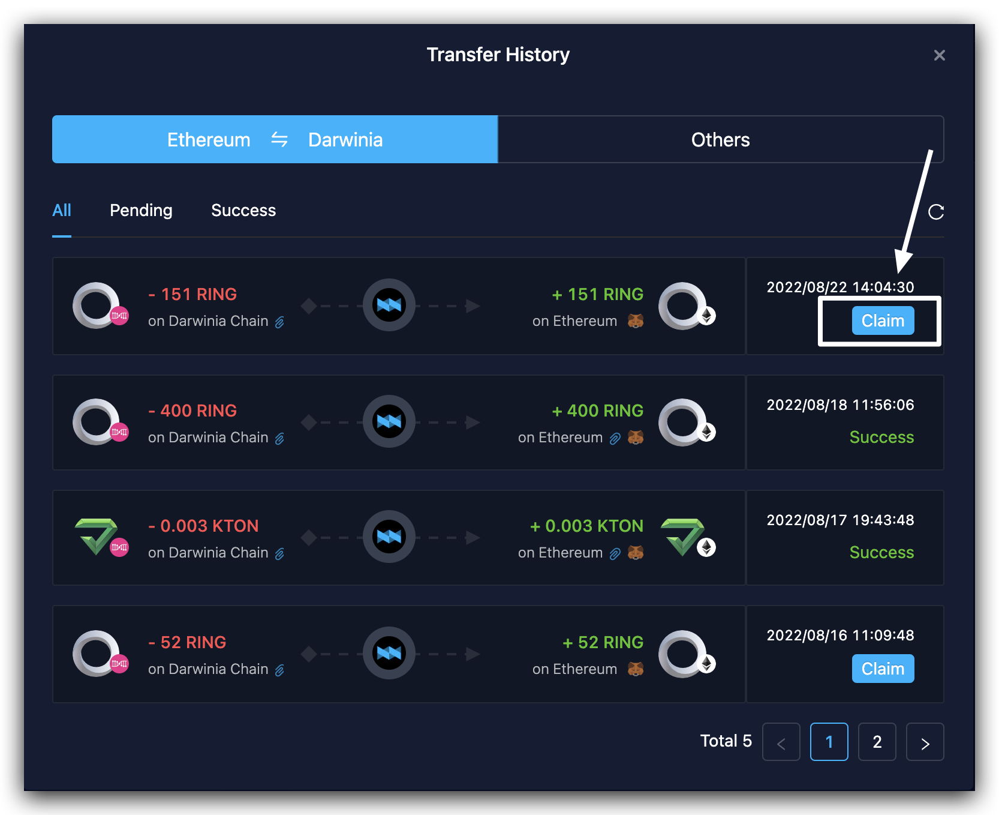

1. Visit Helix Bridge at [helix bridge app](https://apps.helixbridge.app). 
2. **Select a token** that you want to transfer. (make sure that it’s on the proper chain)

3. **Select a target network and the corresponding token** that you want to receive.

*The options for available tokens and target networks depend on your selection in the previous step.*
4. **Choose the appropriate bridge** for the transfer:    
a. Fill in the transfer amount, the available bridges will be displayed on the right side.     
b. Choose one of them, and you’ll see the estimated transaction fee and estimated token amount you‘ll receive on the target chain.     
c. Make a choice then with this information as a reference.

5. **Connect the corresponding wallet**, e.g., polkadot{.js}, MetaMask...
The current sender address will show in the the top right corner of the page, while the balance will show under the Token Button.

> Note that you should connect to the ***Right Network*** and address to initiate a transfer. Please pay attention to our tips and switch to the correct one in the top right corner of the page by clicking “wrong network”.
>

6. Review your transfer details and click "Transfer". You will receive a popup for transfer confirmation. Click “**Confirm Transfer**” only when every detail is checked. 

>Sometimes you may need to initiate a claim transaction of the target network to receive this token. Just check and claim in the `Claim Page`. You need to prepare some ETH as the gas fee to claim this token.
>

7. Then you will be prompted to **confirm the transaction in polkadot{.js}**（or in MetaMask if your currently connected wallet is MetaMask）. Click "Confirm". 
8. After confirming on polkadot{.js}, you have submitted the transaction. 
9. When the transfer is completed, the transaction status will turn to “Success”. You can check the transaction status and details in `“History”`. If it's a Ethereum - Darwinia transfer record, check it in [Ethereum-Darwinia record](https://apps.helixbridge.app/history) ,connect your wallet and click the link icon. 

If for other records, check it in [History Record](https://helixbridge.app/transaction), filter by your address and click the record for details.

**Congratulations on successfully completing your first cross-chain asset transfer on Helix!**
